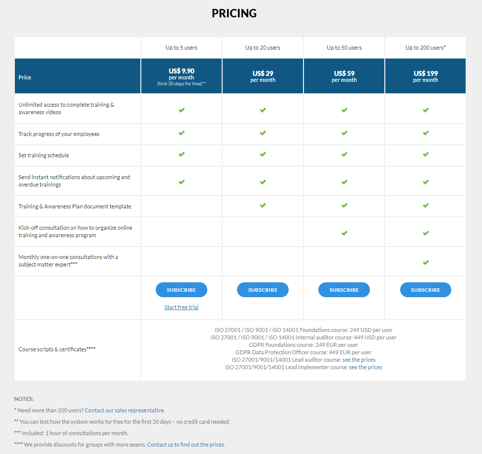

# HTML - CSS

## HTML Temel Konular

 1. [Giriş](https://www.youtube.com/watch?v=jiCSs0Weiqk)
 2. [W3C Nedir?](https://www.youtube.com/watch?v=Gw4R1XsavoM)
 3. [Görüntü Seviyeleri (Div, Span)](https://www.youtube.com/watch?v=sRo1eoW7PeA)
 4. [Başlık ve Paragraf Etiketleri](https://www.youtube.com/watch?v=vzmSTqw1X3Q)
 5. [Metin Biçimlendirme Etiketleri](https://www.youtube.com/watch?v=uew8XqPR--o)
 6. [Link Etiketi](https://www.youtube.com/watch?v=-nLW6UtvykM)
 7. [Resim Etiketi](https://www.youtube.com/watch?v=nF9ME5hPZ9k)
 8. [Tablo Etiketi](https://www.youtube.com/watch?v=mlZ_va-h-6I)
 9. [Liste Etiketleri](https://www.youtube.com/watch?v=faQM8OYGm98)
 10. [Medya Etiketleri](https://www.youtube.com/watch?v=FEc9MTZCQy0)
 11. [Iframe Etiketi](https://www.youtube.com/watch?v=TPtSH1XOWYM)
 12. [Form Etiketleri (Bölüm 1)](https://www.youtube.com/watch?v=2iqiTtQTTOA)
 13. [Form Etiketleri (Bölüm 2)](https://www.youtube.com/watch?v=tAqtmGJK2xc)

## Html Ödevi

Aşağıdaki görselde bulunan tasarımı yukardaki html kodlarını kullanarak html'e dökün. 
Kodunuzu bu repository içindeki **odevler** klasörünün içine kendi kullanıcı adınızla bir klasör oluşturarak içine koyun. 
Commit'leyip   pull request oluşturun. Ödev kontrolleri pull requestler üzerinden yapılacak. 

